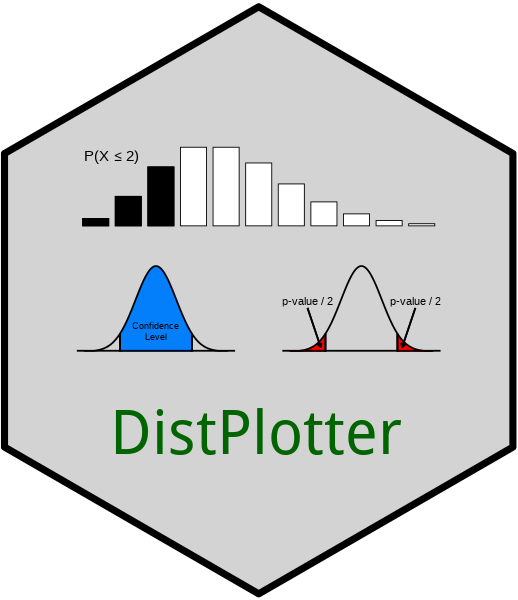

# DistPlotter 

A graphical user interface for plotting common univariate distributions

<!-- start badges -->
<!-- start badges -->

 [](https://CRAN.R-project.org/package=DistPlotter)
<!-- end badges -->

## Description

The `DistPlotter` `R` package includes an interactive Shiny application,
which is run locally on the user’s machine. It enables users to plot
common univariate distributions and was designed with a particular focus
on education. Users can plot distributions based on general shape (e.g.,
symmetric vs. skewed right) and distributions from common discrete and
continuous families. They can also shade areas underneath the curve
(e.g., areas corresponding to general probabilities, p-values, or
confidence levels). Users can additionally plot their own quantitative
data, as well as overlay a normal density curve and shade area(s)
underneath.

## Installation

The `DistPlotter` package can be installed from either
<a href="https://cran.r-project.org/" target="_blank">CRAN</a> or
<a href="https://github.com" target="_blank">GitHub</a>.

#### Installing from CRAN

To install from CRAN, run the following code in `R`:

``` r
install.packages("DistPlotter")
```

#### Installing from GitHub

To install the package from GitHub, run the following code in `R`:

``` r
install.packages("remotes")  # installs the remotes package for accessing the install_github() function
remotes::install_github("ccasement/DistPlotter")  # installs the DistPlotter package
```

## Usage

The `DistPlotter` application can be run using a single line of code in
`R`:

``` r
DistPlotter::runDistPlotterApp()
```

## Bug Reporting

If you happen to find any bugs, we kindly ask that you email us at
<casementc@gmail.com>.

## License

`DistPlotter` is distributed under the MIT license. For details, see the
LICENSE.md file.
